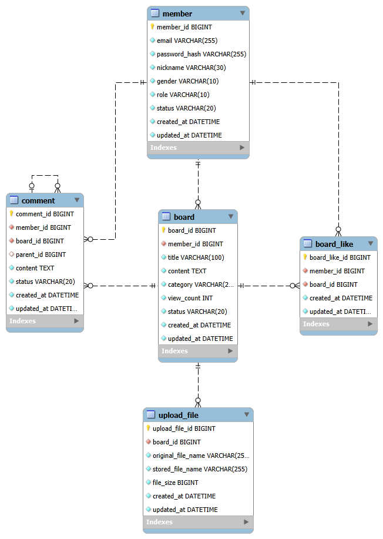

# Database Design

## 개요

본 문서는 Dev Board 프로젝트의 데이터베이스 구조를 정의한다.  
각 테이블의 컬럼 및 제약조건, 테이블 간 관계, 삭제 및 참조 정책, ERD를 다룬다.

데이터베이스 구조와 직접 관련된 규칙은 본 문서에 함께 명시하며,
실제 데이터베이스 스키마를 정의하는 DDL은 [schema.sql](../sql/schema.sql)에서 관리한다.  
전체 도메인 규칙 및 비즈니스 정책은 [Domain Design](./domain-design.md)에서 다루며,
주요 설계 의사결정의 배경과 근거는 [Architecture Decisions](./architecture-decisions.md)에 기록한다.

---

## 테이블 설계

### 1. MEMBER

#### 설명

- `회원` 정보를 저장하는 테이블

#### 컬럼 및 제약조건

|      컬럼명      |    데이터 타입    | NULL 허용 |                              제약조건                               |    설명    |
|:-------------:|:------------:|:-------:|:---------------------------------------------------------------:|:--------:|
|   member_id   |    BIGINT    |   불가    |                       PK (AUTO_INCREMENT)                       |  회원 식별자  |
|     email     | VARCHAR(255) |   불가    |                             UNIQUE                              |   이메일    |
| password_hash | VARCHAR(255) |   불가    |                                -                                | 비밀번호 해시값 |
|   nickname    | VARCHAR(30)  |   불가    |    UNIQUE,<br/>CHECK(char_length(nickname) BETWEEN 2 AND 30)    |   닉네임    |
|    gender     | VARCHAR(10)  |   불가    | DEFAULT 'NONE',<br/>CHECK(gender IN ('MALE', 'FEMALE', 'NONE')) |    성별    |
|     role      | VARCHAR(10)  |   불가    |      DEFAULT 'USER',<br/>CHECK(role IN ('USER', 'ADMIN'))       |  회원 역할   |
|    status     | VARCHAR(20)  |   불가    |  DEFAULT 'ACTIVE',<br/>CHECK(status IN ('ACTIVE', 'DELETED'))   |  회원 상태   |
|  created_at   |   DATETIME   |   불가    |                                -                                |   생성일시   |
|  updated_at   |   DATETIME   |   불가    |                                -                                |   수정일시   |

---

### 2. BOARD

#### 설명

- `게시글` 정보를 저장하는 테이블

#### 컬럼 및 제약조건

|    컬럼명     |    데이터 타입    | NULL 허용 |                             제약조건                             |    설명     |
|:----------:|:------------:|:-------:|:------------------------------------------------------------:|:---------:|
|  board_id  |    BIGINT    |   불가    |                     PK (AUTO_INCREMENT)                      |  게시글 식별자  |
| member_id  |    BIGINT    |   불가    |                              FK                              | 작성 회원 식별자 |
|   title    | VARCHAR(100) |   불가    |                              -                               |  게시글 제목   |
|  content   |     TEXT     |   불가    |                              -                               |  게시글 내용   |
|  category  | VARCHAR(20)  |   불가    | CHECK(category IN ('NOTICE', 'FREE', 'QNA', 'STUDY', 'JOB')) | 게시글 카테고리  |
| view_count |     INT      |   불가    |                          DEFAULT 0                           |    조회수    |
|   status   | VARCHAR(20)  |   불가    | DEFAULT 'ACTIVE',<br/>CHECK(status IN ('ACTIVE', 'DELETED')) |  게시글 상태   |
| created_at |   DATETIME   |   불가    |                              -                               |   생성일시    |
| updated_at |   DATETIME   |   불가    |                              -                               |   수정일시    |

---

### 3. COMMENT

#### 설명

- `댓글 및 대댓글` 정보를 저장하는 테이블
- `일반 댓글`과 `대댓글`은 동일한 COMMENT 테이블에서 관리한다.

#### 컬럼 및 제약조건

|    컬럼명     |   데이터 타입    | NULL 허용 |                             제약조건                             |    설명     |
|:----------:|:-----------:|:-------:|:------------------------------------------------------------:|:---------:|
| comment_id |   BIGINT    |   불가    |                     PK (AUTO_INCREMENT)                      |  댓글 식별자   |
| member_id  |   BIGINT    |   불가    |                              FK                              | 작성 회원 식별자 |
|  board_id  |   BIGINT    |   불가    |                              FK                              |  게시글 식별자  |
| parent_id  |   BIGINT    |   허용    |                              FK                              | 부모 댓글 식별자 |
|  content   |    TEXT     |   불가    |                              -                               |   댓글 내용   |
|   status   | VARCHAR(20) |   불가    | DEFAULT 'ACTIVE',<br/>CHECK(status IN ('ACTIVE', 'DELETED')) |   댓글 상태   |
| created_at |  DATETIME   |   불가    |                              -                               |   생성일시    |
| updated_at |  DATETIME   |   불가    |                              -                               |   수정일시    |

#### 설계 및 검증 규칙

- `parent_id`가 `NULL`이면 `일반 댓글`을 의미한다.
- `parent_id`가 존재하면 `대댓글`을 의미한다.
- `parent_id`는 `COMMENT.comment_id`를 참조하는 자기 참조 외래키이다.
- 부모 댓글은 일반 댓글이어야 한다.
- 대댓글은 다른 댓글의 부모 댓글이 될 수 없다.
- 대댓글 깊이를 1단계로 제한하는 규칙은 애플리케이션에서 검증한다.
- 부모 댓글과 대댓글이 동일한 게시글에 속하는지도 애플리케이션에서 검증한다.

---

### 4. BOARD_LIKE

#### 설명

- `게시글 좋아요` 정보를 저장하는 테이블

#### 컬럼 및 제약조건

|      컬럼명      |  데이터 타입  | NULL 허용 |        제약조건         |        설명        |
|:-------------:|:--------:|:-------:|:-------------------:|:----------------:|
| board_like_id |  BIGINT  |   불가    | PK (AUTO_INCREMENT) |     좋아요 식별자      |
|   member_id   |  BIGINT  |   불가    |         FK          | 좋아요를 등록한 회원 식별자  |
|   board_id    |  BIGINT  |   불가    |         FK          | 좋아요가 등록된 게시글 식별자 |
|  created_at   | DATETIME |   불가    |          -          |       생성일시       |
|  updated_at   | DATETIME |   불가    |          -          |       수정일시       |

#### 복합 Unique 제약조건

- `UNIQUE(member_id, board_id)`: 동일 회원이 동일 게시글에 좋아요를 중복 등록하는 것을 방지한다.

---

### 5. UPLOAD_FILE

#### 설명

- `첨부파일` 정보를 저장하는 테이블

#### 컬럼 및 제약조건

|        컬럼명         |    데이터 타입    | NULL 허용 |        제약조건         |        설명         |
|:------------------:|:------------:|:-------:|:-------------------:|:-----------------:|
|   upload_file_id   |    BIGINT    |   불가    | PK (AUTO_INCREMENT) |     첨부파일 식별자      |
|      board_id      |    BIGINT    |   불가    |         FK          | 첨부파일이 등록된 게시글 식별자 |
| original_file_name | VARCHAR(255) |   불가    |          -          | 사용자가 업로드한 원본 파일명  |
|  stored_file_name  | VARCHAR(255) |   불가    |          -          |    서버에 저장된 파일명    |
|     file_size      |    BIGINT    |   불가    |          -          |    파일 크기(byte)    |
|     created_at     |   DATETIME   |   불가    |          -          |       생성일시        |
|     updated_at     |   DATETIME   |   불가    |          -          |       수정일시        |

---

## 테이블 관계

### 1. MEMBER ↔ BOARD

#### Cardinality

- MEMBER (1) : BOARD (N)

#### 외래키 제약조건

- BOARD.member_id (FK) → MEMBER.member_id (PK)

#### 설명

- 하나의 회원은 여러 개의 게시글을 작성할 수 있다.
- 하나의 게시글은 반드시 하나의 회원에 의해 작성된다.

---

### 2. MEMBER ↔ COMMENT

#### Cardinality

- MEMBER (1) : COMMENT (N)

#### 외래키 제약조건

- COMMENT.member_id (FK) → MEMBER.member_id (PK)

#### 설명

- 하나의 회원은 여러 개의 댓글을 작성할 수 있다.
- 하나의 댓글은 반드시 하나의 회원에 의해 작성된다.

---

### 3. BOARD ↔ COMMENT

#### Cardinality

- BOARD (1) : COMMENT (N)

#### 외래키 제약조건

- COMMENT.board_id (FK) → BOARD.board_id (PK)

#### 설명

- 하나의 게시글은 여러 개의 댓글을 가질 수 있다.
- 하나의 댓글은 반드시 하나의 게시글에 속한다.

---

### 4. COMMENT ↔ COMMENT

#### Cardinality

- COMMENT (1) : COMMENT (N)

#### 외래키 제약조건

- COMMENT.parent_id (FK) → COMMENT.comment_id (PK) (Self Reference FK)

#### 설명

- 하나의 일반 댓글은 여러 개의 대댓글을 가질 수 있다.
- 하나의 대댓글은 반드시 하나의 부모 댓글에 속한다.

---

### 5. BOARD ↔ UPLOAD_FILE

#### Cardinality

- BOARD (1) : UPLOAD_FILE (N)

#### 외래키 제약조건

- UPLOAD_FILE.board_id (FK) → BOARD.board_id (PK)

#### 설명

- 하나의 게시글은 여러 개의 첨부파일을 가질 수 있다.
- 하나의 첨부파일은 반드시 하나의 게시글에 속한다.

---

### 6. MEMBER ↔ BOARD_LIKE

#### Cardinality

- MEMBER (1) : BOARD_LIKE (N)

#### 외래키 제약조건

- BOARD_LIKE.member_id (FK) → MEMBER.member_id (PK)

#### 설명

- 하나의 회원은 여러 개의 게시글에 좋아요를 누를 수 있다.
- 하나의 좋아요는 반드시 하나의 회원에 속한다.

---

### 7. BOARD ↔ BOARD_LIKE

#### Cardinality

- BOARD (1) : BOARD_LIKE (N)

#### 외래키 제약조건

- BOARD_LIKE.board_id (FK) → BOARD.board_id (PK)

#### 설명

- 하나의 게시글은 여러 개의 좋아요를 가질 수 있다.
- 하나의 좋아요는 반드시 하나의 게시글에 속한다.

---

## 삭제 및 참조 정책

- `MEMBER`, `BOARD`, `COMMENT` 테이블에는 Soft Delete를 적용한다.
- Soft Delete 시 데이터를 물리 삭제하지 않고, `status`를 `DELETED`로 변경한다.
- Soft Delete된 행도 데이터베이스에 남아 있으므로 기존 외래키 관계가 유지된다.
- 외래키에는 `ON DELETE CASCADE`를 적용하지 않는다.

예시

```text
MEMBER.status  : ACTIVE → DELETED
BOARD.status   : ACTIVE → DELETED
COMMENT.status : ACTIVE → DELETED
```

---

## ERD Diagram

본 프로젝트의 데이터베이스 구조를 시각적으로 표현한 ERD이다.



---

## 프로젝트 문서

- [README](../README.md)
  - 프로젝트 소개

- [Domain Design](./domain-design.md)
  - 도메인 모델 및 비즈니스 규칙 정의

- [Architecture Decisions](./architecture-decisions.md)
  - 주요 아키텍처 설계 의사결정 기록

- [Project Progress](./project-progress.md)
  - 현재 프로젝트 진행 현황 및 개발 계획
